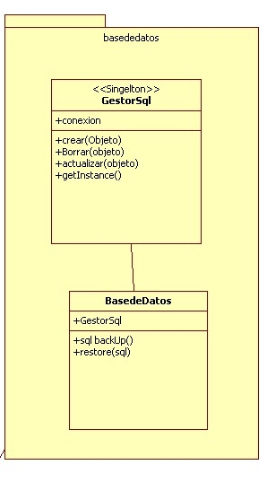
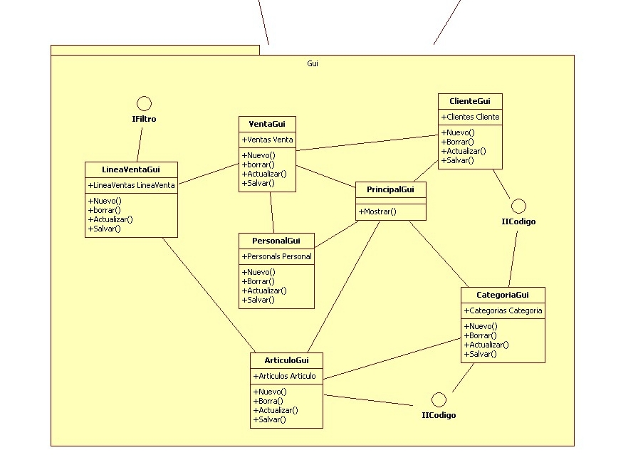
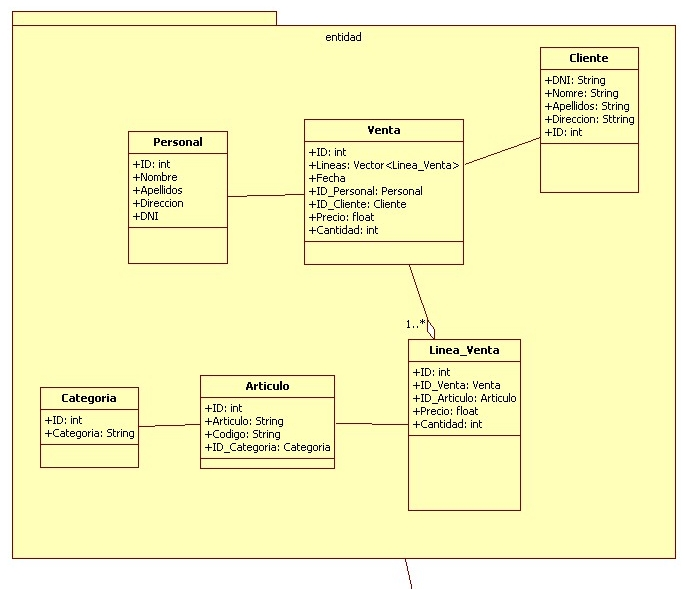
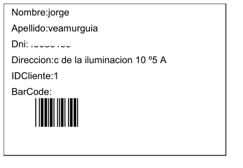
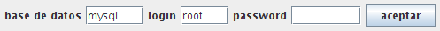
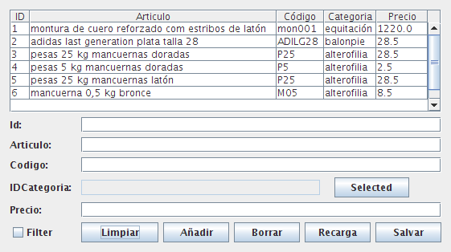

# Introducción a al práctica

Siguiendo los requisitos de la práctica, la aplicación se ha realizado en Java, específicamente con la última versión la 1.6, se ha usado las librerías de Swing. La base de datos es MySql y se vincula con la aplicación con los drivers mysql-connector-java-5.1.12.jar. El desarrollo se ha usado el entorno de eclipse con el plugin jigloo para la creación de los entornos gráficos. 

Para la realización de este documento el software openOfficer y StartUML para representa el diagrama de clases y la generación automática del paquete entidad. Todos ellos software de software libre. Las pantallas generadas no pasa ninguna del tamaño máximo de resolución de pantalla 640X480 propuesto, todas ellas son ventanas flotantes ya que es posible mandarse información entre pantallas.  

## Diseño de la aplicación

El diseño de la aplicación se ha realizado en 3 paquetes que representan las capas de la aplicación, la capa de acceso a la base de datos, los objetos entidad, y la parte gráfica de la aplicación en la que se ha insertado la lógica de negocio.

### Base de datos orientadas a objetos

La base de datos de MySql, es una base de datos relacional. Para realizar una mejor integración con la aplicación y no tener que construir las consultas SQL cada vez que se modifica una tabla, hemos realizado una aproximación a las base de datos orientadas a objetos. Esto es, no realizamos consultas de SQL directamente por cada tabla. Las consultas se realizan de manera dinámica por cada objeto. Se ha implementado usando la funcionalidad que da java a través de reflection.

### Reflection 
	
Reflection es la capacidad que tiene java en nuestro caso y otros muchos mas lenguajes, de dar toda las características de una clase o de un objeto en tiempo de ejecución. En la aplicación el paquete entidad, se usa el nombre de la clase, los atributos de los objetos y sus valores. Con el nombre de la clase se accede a la tabla de la base de datos, los atributos de las clases indican los campos de esa tabla y los valores de cada una de los objetos, indica el valor de ese registro.

### Entidad

Los objetos entidad, son objetos muy simples, que solo contiene atributos. Estos atributos, y a través de reflection, se encarga de realizar la gestión de las tablas que son los encargados del soporte de cada uno de los datos de las tablas. En la aplicación se usa las clases del paquete entidad con ID que indica el Identificador del registro de la tabla, el cual es  ID auto-numérico. Para crear las relaciones con las otras tabla de la base de datos, se usa la clave foránea. Para indicar a la clase que tiene una relación con otra tabla, se realiza con el “ID_nombre de la clase”, Este atributo será del tipo de dato igual a la clase entidad que se relacione. Es decir, en la clase entidad venta, hay un atributo como en todas las clases entidades que es ID de tipo entero y para relacionar las ventas con el cliente y con el personal de la tienda  2 relaciones foraneas que son  ID_Cliente de tipo de datos Cliente ID_Personal que es de tipo de dato Personal. Son las únicas restricciones que se tienen a la hora de crear un clase en el paquete entidad. Las clase dentro del paquete entidad solo se relacionan uno a N. En nuestro caso solo se han encontrado relaciones de este tipo de datos.  En el caso de haber encontrado algún tipo de entidad de tipo N a N, la solución seria dividir las relaciones en tres entidades.
	

#### Entidad Categorías
Tiene un ID entero y un atributo Categoría de tipo cadena.

#### Entidad Articulo
Tiene un ID entero, una relación ID_categoria con el objeto Categoría, Codigo de articulo de tipo cadena, un campo Articulo de tipo cadena y un precio de tipo coma flotante. 
	
#### Entidad Cliente
Tiene un ID entero y  campos de apellidos, nombre, dirección y DNI de tipo cadena. No se ha implementado validadores del DNI al poder existir carnet de extranjeros que pueden llevar otro tipo de validación o al existir empresas con el CIF.

#### Entidad Personal
Tiene un ID entero y un campo de apellidos nombre dirección y DNI de tipo cadena.

#### Entidad Venta
Tiene un ID entero y 2 relaciones una con persona y otra con cliente, la relación de persona es ID_Personal y la de cliente es ID_Cliente 
	
#### Entidad Linea venta
Tiene un ID entero y 2 relaciones, una con articulo y la otra con la tabla de venta. La relación con la entidad de venta es ID_Venta y la relación con la entidad de Articulo es ID_Articulo.
Dentro de las lineas de ventas están los campos de descuento, impuesto cantidad y precio, que nos sirve para poder sacar la suma total del precio de la venta de un cliente.

### Gestión de la base de datos.
	
Dentro del paquete de la base de datos se han creado 2 clases para la gestión de la base de datos. Estas clases son GestorSql y CrearBaseDeDatos. GestorSql  es el encargado de realizar la conexión a la base de datos, se realiza a través del patrón de diseño singleton. Esta conexión es única. Se guarda la instancia de la conexión  de la base de datos y si se intenta crear una nueva conexión, se devuelve la conexión ya creada. Esto nos sirve para poder gestionar la conexión de la base de datos de forma centralizada. Además la base de datos, la clase GestorSql es la encargada de generar las consultas para cada tipo de objeto a través de reflection. Tiene un  método por cada acción a realizar, como la inserción, la actualización, el borrado y la búsqueda. Para generar una consulta en tiempo de ejecución se para una objeto del paquete.

En la aplicación se ha realizado un control de acceso a datos como si fuera una base de datos orientada objetos. No se ha implementado un patrón de diseño DAO, pero el funcionamiento ha estado muy cercano a este patrón. La implementación del acceso a la base de datos se ha realizado en 2 pasos. Primero se ha creado un acceso a la base de dato, implementando el patrón singleton creando un gestor de base de datos que se encarga de abrir el acceso a la base de datos y el cual implementa los métodos mas importantes de acceso a la base de datos que son create update delete.   Estos métodos reciben cada uno de los objetos a serializar en la base de datos. Otro método importante es el find. 

#### Metodo find
	
Como ejemplo de búsqueda se comenta como se usa el método find dentro de la gestión de la base de datos junto con reflection y los objetos entidad para dar una visión completa del trabajo realizado. Cuando se quiere mostrar unos datos dentro de la aplicación, primero se instancia un objeto del tipo de datos que necesitamos con la instrucción típica de java como:
	
	Cliente cliente =new Cliente();

Solamente con esta instrucción se pasa al método find de la base de datos, devolverá un array de objetos del mismo tipo de datos, en nuestro caso de tipo cliente. 

Si se quiere buscar o filtrar un objeto de cliente determinado para este fin, se usa los atributos de objeto, para nuestro ejemplo de la clase cliente sería

	cliente.ID=1;

Al pasar el objeto con el atributo ID igual a 1, genera con reflection una consulta sql, que para nuestro caso es transparente y nos devuelve un array de los objetos clientes con un solo elemento si es que existe este elemento en la base de datos.
Si se quiere filtrar por algún campo el método find tiene un segundo parámetro además de el objeto a buscar, que se puede activa, con esta activación, la consulta sql que genera es en vez de que la consulta sea igual al campo se cambia por la instrucción de sql que indica que la consulta generada sea parecida con el operador LIKE útil para buscar por aproximaciones en campos de tipo cadena.

### Diagrama de clases 
El diagrama de clases se ha dividido en 3 paquetes. El paquete entidad que ya hemos comentado como funciona el paquete base de datos, con el potente método find que nos abstrae de la generación de las consultas personalizadas de la base de datos y el paquete Gui donde está implementada la gestión de la parte gráfica. 

### Interfaz de comunicaciones de la parte gráfica

Las pantallas gráficas que se ha realizado, pueden ser llamadas desde cualquier otra pantalla.  Para comunicarse con cada una de ellas, se han creado un interfaz para pasarse los mensajes de comunicación. Los interfaz en java son un contrato que tiene que cumplir si quieres que tus objetos  se hablen entre ellos. Para el envío de los códigos de las tablas que se relacionan entre ellos se implementa los interfaz. En la aplicación se han definido 2 interfaz, uno genérico se basa en el envío del código devuelto a la pantalla que desde la cual ha llamado. Junto con este código, se envía también la cadena de texto que lo representa.
  
     public interface IIDCodigo {
      public void setCodigo (int codigo,String valor);
      public int getIDCodigo();
      public String getIDValor();
    }
 
	      
      
      
####  Impresión del carnet de cliente con código de barras (barcode)

La realización del carnet de cliente se imprime los datos personales del cliente y a demás e incluido la impresión de un código de barras. Esto se realiza con cambiando la fuente de impresión del texto del código de cliente a través de un fichero de TrueType con licencia software libre. El tipo de código de barras es C39, que se caracteriza por tener que incluir al inicio y al final del código que se imprime el carácter asterisco. 

	      

#### Mejoras y propuestas

Debido al poco tiempo disponible para realizar la aplicación de gestión, esta podría mejorarse enormemente, como la realización de un control de stock y de almacenes para las distintas tiendas. O una gestión de pedidos realizados a cada uno de los distribuidores. He de comentar que cualquier modificación de la base de datos se realizaría no editando las tabla de la base de datos, sino que se realizaría modificando los objetos entidad. La base de datos se conecta a una base de datos localhost, cambiar esta restricción a una base de datos distribuida sería otro posible punto de mejora. 

#### Manual de uso de la aplicación

La aplicación esta compuesta por pantallas flotantes que no superan el tamaño de 640X480. Estas disposición de pantallas, se ha realizado así para tener la posibilidad de tener abiertas varias de ellas y trabajar enviándose información entre las pantallas. Lo primero que se muestra nada mas abrir la aplicación es un pantalla con una barra de menú. En ella se nos muestran 2 opciones, gestión y herramientas.

#### 	Menú de herramientas

Empecemos por las herramientas: El submenu de las herramientas nos da un listado de las operaciones que se pueden hacer con la base de datos. El listado de las opciones son:
1. copia de seguridad
2. restaura copia de seguridad
3. seleccionar base de datos
4. crear una nueva base de datos
5. ayuda

#### Opción de copia de seguridad.

La copia de seguridad es una herramientas que nos guarda toda la estructura de la base de datos en un fichero de texto plano en formato de MySql. Nos crea un fichero con todos los datos que tenemos hasta el momento. Esta opción es interesante hacerla todos los días para mantener una copia de la base de datos en un soporte físico externo y prevenirnos de pérdida de datos.

#### Restaurar base de datos.
	
Es la operación inversa a la copia de seguridad, se encarga de dejar la gestion de la tienda en el estado en el que estaba cuando se realizó la copia de seguridad. Hay que tener especial cuidado ya que los datos que actualmente esten en uso se perderán. 

#### Seleccionar base de datos.
	
Ante de realizar cualquier tipo de operación con la aplicación, lo primero que hay que realizar es la apertura de la base de datos. Ya que sin esta operación no se puede realizar el resto de gestiones de que se disponen en la aplicación. Hay que tener en cuenta que el sistema de gestión de base de datos es MySql y que debe estar instalado en la máquina local, ya que la aplicación no permite conectarse a una base de datos remota.

	      

Para abrir la base de datos, deberemos introducir cada uno de los valores que se indican en la pantalla. En el caso de no poder conectar con la base de datos saldrá una pantalla indicando el problema.

#### Crear una nueva base de datos

Para inicia la aplicación como hemos indicado la primera operación que hay que realizar es conectarse con la base de datos. Como no existe todavía una base de datos, lo primero que hay que realizar es una conexión a la base de datos del Sistema de MySql. Para abrir la conexión a la base de datos del sistema hay que establecer los parámetros que se indicaron a la hora de instalar la base de datos. El sistema por defecto de MySql la base de datos se llama mysql y el usuario es root y la password se deja en blanco, claro que estos parámetros se han podido modificar durante la instalación del sistema MySql.

En esta imagen se muestra la conexión del la base de datos de MySql.

Una vez que se ha conectado con el sistema de MySql pulsamos el botón de crea una nueva base de datos. El sistema pedirá introducir un nombre de la base de datos.  Una vez creada, se debe conectar a la base de datos nueva. En ella encontraremos la estructura de la base de datos ya creada. 

Esta funcionalidad de la es importante por si tenemos varias tiendas o almacenes, así se tiene la posibilidad de crear varias bases de datos por tienda.

## Ayuda
	
En esta pantalla pueden encontrar los datos del autor de la aplicación.

##	Menú de herramientas
Una vez visto el menu de herramientas, pasamos a hablar del menú de la gestion de la tienda. En el nos encontramos los intrefaces gráficos par la gestion de la tienda. La opciones son 
1. Gestión de Categorías
2. Gestión de Artículos
3. Gestión de Personal
4. Gestión de ventas
5. Gestión de clientes

Todas las pantallas en la parte de gestión tiene la misma metáfora en su comportamiento. Se divide en tres parte. La parte de la tabla de resultados, la parte de detalle y la parte de acciones sobre el detalle.

 

En la parte de la tabla se nos muestran los resultados de los datos de la base de datos

En la parte de detalle nos sirve para ver con mas detalle cada uno de los elementos que se seleccione en la parte de detalle, también para usarlo para modificar los datos de un registro y para realizar acciones de filtrado.

La parte de acciones nos da la funcionalidad de actuar sobre los datos. 

#### Tabla

En la tabla se muestran los resultados totales y parciales de la tabla de la base de datos. También sirve para seleccionar un elemento y actuar sobre este. Ya sea borrándolo o modificando sus datos.

#### Detalle
	
En los campos de detalle se muestran los datos de cada uno de los elementos que hemos seleccionado. Hay que prestar atención que existen una serie de botones a la altura de los cuadro de textos que están deshabilitados para su modificación. Estos botones son los encargados de abrir una nueva ventana para seleccionar el elemento adecuado de la tabla. Estos campos de texto solamente se pueden modificar de esta manera, no pudiendose escribir sobre ellos. 

#### Botones de acciones
	
El primer elemento de los botones de acciones, no es un botón, es un elemento de chequeo que sirve para filtra los datos de la tabla. Cuando el chequeo de filtro esta activo solamente se mostrarán los datos que coincidan  con los datos de detalle. Los únicos campos de detalle que no activan los filtros son los datos en coma flotante. Los datos de filtro son filtros de tipo AND, es decir, cada campo que insertamos son mas restrictivos. No hace falta completar la palabra,ya que, se busca en la base de datos por todas las palabras que contengan parte de la palabra introducida.

En el primer paso vemos que hay 6 artículos en la base de datos, 3 de ellos tienen la palabra “latón”. Introducimos la palabra “latón”.

Para activar el filtro simplemente pinchamos en el check y automáticamente la tabla solo mostrará los datos de artículos que tiene la palabra “latón” en su descripción. Si queremos además queremos filtrar por categoría, deberemos pulsar  el botón que está a la misma altura que la caja de texto categoría.

Al seleccionar la categoría, esta sale establecida en la caja de texto que no es modificable. Para que este nuevo filtro esté activo tenemos dos opciones, pulsar el botón de recargar o deschequear el componente de filtro y volverlo a chequear

Ahora tenemos el filtro activo y solo mostramos los artículos que tiene la palabra “latón” y que pertenecen a la categoría “equitación”.

#### BOTÓN LIMPIAR

Para limpiar los datos que hay estan en la caja de texto solamente deberemos pulsar el botón de limpiar. Este botón borrara todos los datos de la caja de texto de detalle y de la categoría.

#### BOTÓN AÑADIR

Para añadir datos en cualquier a de las tablas de la aplicación, tenemos que rellenar los datos de detalle. No es necesario introducir el campo identificador del elemento de la tabla. En la tabla esta definido como autonumérico. Si se quiere se puede introducir un ID numérico elegido por el usuario, el sistema detectará si ese ID ya existe en la tabla.

#### BOTÓN BORRAR 

Para borrar un elemento de una tabla se selecciona el componente de la tabla y se pulsa borrar. Hay que tener en cuenta que hay relaciones entre los datos de cada tabla. Es decir si borramos un articulo de la lista de artículos el sistema  nos avisa si ese  articulo aparece en una venta, y si deseamos borrar los datos de la venta. Si seleccionamos que si toda la venta será borrada. En el caso de la tabla de categoría, si se intenta borrar una categoria asociada a un articulo el sistema no nos lo permitirá.

#### BOTÓN RECARGAR 

El botón recargar tiene una única funcionalidad que puede ser activada cuando: El usuario quiera restablecer el filtro, cuando quiera recargar los datos que han sido modificados desde otra ventana. 

#### BOTON SALVAR

Una vez que desde la tabla se ha seleccionado un elemento, y este se muestra en la parte de detalle, estos datos pueden ser modificados, pero no serán guardados en la base de datos hasta que no se haya pulsado el botón de salvar. Si se ha modificado un valor incorrectamente como el ID nos dará un error al intentar salvar. Hay que tener especial cuidado si se modifica el valor de ID ya que lo que se estará haciendo, si existe previamente el valor de este ID en la base de datos, es machacar el registro del ID, con los nuevos datos. Si no existe en la base de datos este ID, son aparecerá un error. No es recomendable modificar le valor de ID.

#### Realización de una venta

Las ventas se componen de 4 elementos, el personal que las realiza el cliente y las líneas que se añade por cada producto y la suma total de la venta. Para realizar una venta se selecciona el personal que la realiza y el cliente. Si no existen en la base de datos se dan de alta. Es posible darlos de alta desde el mismo formulario de la venta. Esto nos dará una mayor agilidad a la hora de poder gestionar las ventas. Evidentemente el personal que trabaja en la tienda debe de estar dado de alta, por lógica en la aplicación pero es posible hacerlo desde aquí.

	

Dentro de la pantalla de ventas podemos añadir una  nueva venta seleccionando el personal que realiza la venta y el cliente, una vez que se han añadido estos dos elementos seleccionaremos las líneas de ventas en el botón de venta.

En nuestro caso damos de alta el personal al realizar la primera venta. Al igual que la gestion de artículos y de categorias introducimos los datos sin el ID y pulsamos el boton de añadir. Con esta operación creamos nuestro primer empleado. Seleccionamos el empleado de la tabla y pulsamos  sobre la aspa para cerrar la pantalla así pasaremos el valor del empleado a la tabla de ventas

Como se observa en la imagen ya tenemos el personal que se encarga de la venta, a continuación operamos con el cliente de la misma manera. 

Una vez seleccionado el cliente y el personal creamos cada uno de las lineas de la venta

El cliente tiene la opción de imprimir un carnet de la tienda seleccionando el cliente de la tabla y pulsando el botón imprimir 
En el cual puede observarse que tiene todos los datos del cliente y a demás se  imprime un codigo de barras para su lectura con la pistola lectora. El tipo de código de barras es el C39 solamente almacenamos el ID del cliente entre asteriscos ya que es como esta especificado en el estandar..

Para crear lineas de ventas pulsamos sobre el botón  de venta.

Con esto generamos una venta sin líneas de ventas. Ahora procederemos a insertar cada una de las lineas de venta en la venta. Se muestra la pantalla con las lineas de ventas filtrada por defecto por la venta que hemos abierto, por eso se necesita primero crear la venta con el cliente y con el personal. Una vez que tenemos la pantalla de lineas de ventas seleccionamos los artículos buscándolos por categorías o por código del artículo.

Filtramos los artículos por la categoría. Nos muestra solamente aquellos artículos de ea categorías

seleccionamos cada articulo de la venta

Al seleccionar el articulo rellenamos a mano los impuestos, el descuento , el precio y la cantidad. 
 

Añadimos ahora la primera línea de la venta. 

Esto nos muestra el precio de esta primera línea como 5.22 una vez introducido cada uno de los datos de la linea.
Si nos vamos a la pantalla de venta veremos que en el campo de precio se ha actualizado a 5.22.

El cual podemos dejarlo así o modificar el precio si queremos. Y lo podemos salvar actualizando el valor de la línea de venta. Si queremos podemos seguir con las lineas de venta donde lo dejamos añadiendo mas elementos a la venta.

Pulsamos el botón de limpiar en las lineas de venta para poder introducir una nueva línea de venta. Si no hemos cerrado la pantalla de artículos seleccionamos los artículos para una nueva linea igual que como lo hemos realizado antes.

Al acabar de introducir la linea el precio total de la venta se ha actualizado a la suma de las lineas introducidas, ahora solo hay que ajustar el precio si queremos y pulsar salvar para finalizar la venta.

	Manual de instalación
En el fichero comprimido viene dos ficheros. geston_tienda.sh y gestion_tienda.bat
Este mismo documento llamado memoria.pdf
Una carpeta lib con las  clases y librerias compiladas
Una carpeta con el codigo fuente llamada src
Un fichero llamado bdd.sql que es la base de datos del sistema
20100612_1426.sql que es la base de datos para restaurar si se tiene la consola de administrado deMySql

PASO 1
Para realizar la instalacion de la base de datos como prerrequisito tiene que estar el servidor de base de datos en la maquina local. 
PASO 2
Lanzamos la aplicación con el fichero gestion_tienda y en el menú de herramientas seleccionamos la opción de “seleccionar base de datos”. Una vez seleccionamos la base de datos elegimos como opción de conexión a la base de datos a la base de datos de mysql con login y password el de la instalación de mysql.
PASO 3
Una vez seleccionada la base de datos del mysql crearemos una nueva base de datos llamada gestor. Para ello pulsamos en la opción de generar “nueva base de datos” y la llamaremos gestor. Esta tomará el usuario y password de la base de datos de mysql. 
PASO 4
Una vez generada la base de datos, restauraremos la copia de seguridad bdd.sql.  Pulsamos restarurar en el menú y seleccionamos el fichero, con esto ya se puede empezar a trabajar.
